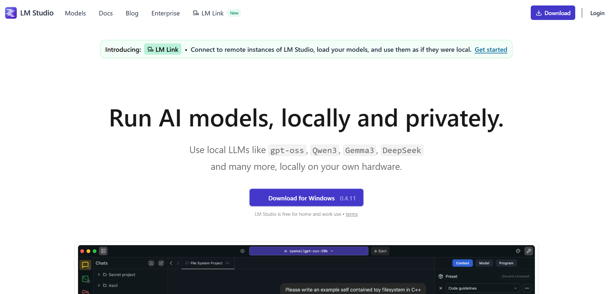
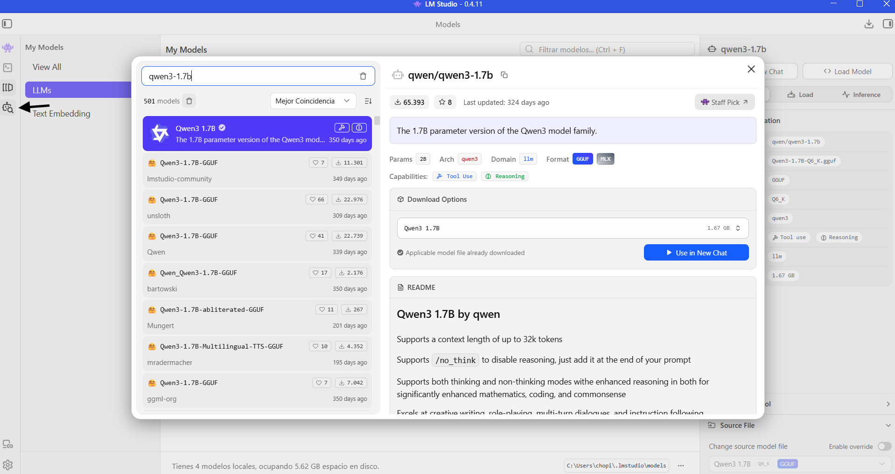
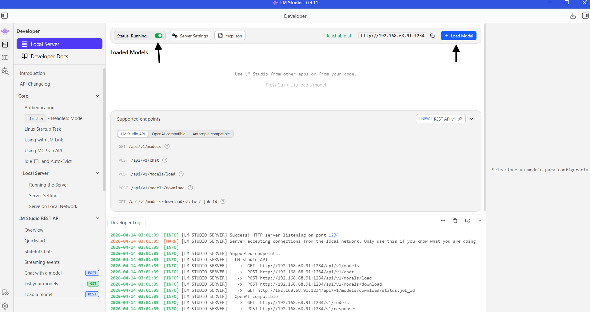
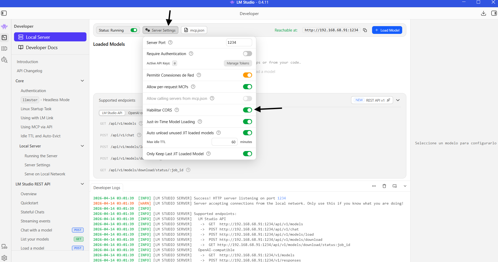

# 🤖 Chatbot Multi-Modelo Local

Un chatbot minimalista que corre **100% en tu máquina**, sin APIs de pago ni datos en la nube. Usa [LM Studio](https://lmstudio.ai/) como servidor local compatible con OpenAI, y permite elegir entre distintos modelos de lenguaje desde el navegador.

---

## 📋 Tabla de contenidos

- [Demo rápida](#-demo-rápida)
- [Requisitos](#-requisitos)
- [Instalación de LM Studio](#-instalación-de-lm-studio)
- [Descargar un modelo](#-descargar-un-modelo)
- [Configurar el servidor local](#-configurar-el-servidor-local)
- [Habilitar CORS](#-habilitar-cors)
- [Cómo usar el chatbot](#-cómo-usar-el-chatbot)
- [Cómo funciona el código](#-cómo-funciona-el-código)
- [Modelos incluidos](#-modelos-incluidos)
- [Solución de problemas](#-solución-de-problemas)
- [Estructura del proyecto](#-estructura-del-proyecto)
- [📚 Información extra](#-información-extra)
  - [Qué son los parámetros de un modelo](#qué-son-los-parámetros-de-un-modelo)
  - [Cómo se entrena un modelo de lenguaje](#cómo-se-entrena-un-modelo-de-lenguaje)
  - [Qué es la cuantización](#qué-es-la-cuantización-q4-q8-etc)
  - [CPU vs GPU](#cpu-vs-gpu-cómo-afecta-la-velocidad)
  - [Tokens y contexto](#tokens-y-contexto)
  - [Los roles en la API](#los-roles-en-la-api-user-assistant-system)
  - [Parámetros de la request](#parámetros-de-la-request-api)
  - [Memoria conversacional](#limitación-actual-memoria-conversacional)
  - [LM Studio vs Ollama](#lm-studio-vs-ollama)
  - [Privacidad](#privacidad-todo-corre-local)

---

## ✨ Demo rápida

Abrí el archivo `chatbot.html` directamente en tu navegador (no necesita servidor web). El indicador de estado te dirá si LM Studio está corriendo.

```
Estado API: ✅ Conectado   →  todo listo
Estado API: ❌ Desconectado →  LM Studio no está corriendo
```

---

## 📦 Requisitos

| Requisito | Detalle |
|-----------|---------|
| Sistema operativo | Windows 10/11, macOS 12+, Ubuntu 22+ |
| VRAM mínima | 4 GB (recomendado 8 GB) |
| RAM mínima | 8 GB (recomendado 16 GB) |
| Espacio en disco | 2–10 GB según el modelo |
| Navegador | Chrome, Firefox, Edge (cualquier moderno) |
| LM Studio | v0.3.x o superior |

---

## 🛠 Instalación de LM Studio

1. Entrá a [https://lmstudio.ai/](https://lmstudio.ai/) y descargá el instalador para tu sistema operativo.

   
   > *Página de descarga de LM Studio — elegí tu sistema operativo.*

2. Ejecutá el instalador y seguí los pasos (es un instalador estándar, no requiere configuración especial).

3. Abrí LM Studio. Al iniciar verás la pantalla principal con el buscador de modelos.

---

## 📥 Descargar un modelo

Dentro de LM Studio, usá el buscador para encontrar e instalar un modelo:

1. Hacé clic en el ícono de **búsqueda** (lupa) en el panel izquierdo.
2. Buscá el nombre del modelo que querés, por ejemplo: `gemma-3-1b` o `qwen3`.
3. Elegí una variante recomendado: **qwen3-1.7b** (por su balance entre velocidad y calidad), aunque **Gemma 3 1B** es mejor en razonamiento (mejor entrenado y razonando, aunque mas pesado).
4. Hacé clic en **Download**.

   
   > *Buscador de modelos — elegí la variante QWEN3-1.7b para un buen balance.*

> 💡 **Tip:** Los modelos de 1B–2B parámetros son los más rápidos y funcionan bien incluso sin GPU dedicada.

---

## ⚙️ Configurar el servidor local

Una vez que tenés el modelo descargado, hay que activar el servidor:

1. Hacé clic en el ícono de **servidor** (el que parece `<->`) en el panel izquierdo. Es la sección **Local Server**.

2. En el panel, seleccioná el modelo que descargaste en el desplegable superior.

3. Hacé clic en **Start Server**.

   
   > *Así luce el panel del servidor — el modelo cargado y el botón Start Server.*

4. El servidor queda disponible en:
   ```
   http://localhost:1234
   ```

---

## 🔓 Habilitar CORS

Para que el navegador pueda hacer peticiones al servidor local **es obligatorio habilitar CORS**. Sin esto, el chatbot dará error aunque LM Studio esté corriendo.

1. En la sección **Local Server**, buscá la opción **"Enable CORS"** o **"Cross-Origin Resource Sharing"**.
2. Activá el toggle (debe quedar en verde/ON).
3. Reiniciá el servidor si ya estaba corriendo (Stop → Start).

   
   > *La opción CORS debe estar habilitada para que el navegador pueda conectarse.*

> ⚠️ **Importante:** Si no activás CORS, el navegador bloqueará todas las peticiones con un error tipo `CORS policy: No 'Access-Control-Allow-Origin'`.

---

## 💬 Cómo usar el chatbot

1. Asegurate de que LM Studio esté corriendo con un modelo cargado (el indicador dirá **"Conectado"** en verde).
2. Abrí `chatbot.html` en tu navegador.
3. Seleccioná el modelo desde el desplegable.
4. Escribí tu mensaje en el campo de texto y presioná **Enviar** o `Enter`.

---

## 🧩 Cómo funciona el código

El archivo `chatbot.html` es una sola página HTML sin dependencias externas. Acá va una explicación de cada parte:

### Verificación de conexión

```javascript
async function checkConnection() {
  try {
    const response = await fetch('http://localhost:1234/v1/models');
    if (response.ok) {
      status.textContent = 'Estado API: Conectado';
      status.style.color = 'green';
    }
  } catch {
    status.textContent = 'Estado API: Desconectado';
    status.style.color = 'red';
  }
}

checkConnection();
setInterval(checkConnection, 5000); // re-verifica cada 5 segundos
```

Consulta el endpoint `/v1/models` de LM Studio al cargar la página y cada 5 segundos. Si responde con `200 OK`, el servidor está activo.

---

### Envío del mensaje

```javascript
const response = await fetch('http://localhost:1234/v1/chat/completions', {
  method: 'POST',
  headers: { 'Content-Type': 'application/json' },
  body: JSON.stringify({
    model: model,          // modelo seleccionado en el <select>
    messages: [
      { role: 'user', content: message }
    ]
  })
});
```

Usa la misma API que OpenAI (`/v1/chat/completions`). LM Studio la implementa localmente, así que el código es compatible con ambos si alguna vez querés migrar.

---

### Estructura del mensaje

| Campo | Descripción |
|-------|-------------|
| `model` | ID del modelo tal como aparece en LM Studio |
| `messages` | Array de turnos de conversación (`role: user / assistant`) |
| `choices[0].message.content` | Texto de la respuesta del modelo |

---

### Flujo completo

```
Usuario escribe → sendMessage() →
  fetch POST /v1/chat/completions →
    LM Studio procesa →
      data.choices[0].message.content →
        addMessage() → se muestra en #chat
```

---

## 🧠 Modelos incluidos

Los modelos preconfigurados en el selector son pequeños, rápidos y corren bien en CPU:

| Modelo | Parámetros | Ideal para |
|--------|-----------|------------|
| `google/gemma-3-1b` | 1B | Respuestas rápidas, bajo consumo |
| `qwen/qwen3-1.7b` | 1.7B | Balance general, buen razonamiento |
| `liquid/lfm2-1.2b` | 1.2B | Eficiencia en hardware limitado |

Para agregar un modelo nuevo, simplemente añadí un `<option>` en el `<select>` con el ID exacto que muestra LM Studio:

```html
<option value="id-del-modelo-en-lmstudio">Nombre visible</option>
```

---

## 🔧 Solución de problemas

| Problema | Causa probable | Solución |
|----------|---------------|----------|
| "Desconectado" en rojo | LM Studio no está corriendo | Iniciá LM Studio y cargá un modelo |
| Error CORS en consola | CORS no habilitado | Activá CORS en la config del servidor |
| Respuesta vacía o error | Modelo no cargado | Seleccioná un modelo en el panel Server |
| Página no carga | Bloqueador de scripts | Abrí el archivo directamente en el navegador, no desde un gestor de archivos restrictivo |

---

## 📁 Estructura del proyecto

```
chatbot-multi-modelo/
├── chatbot.html               # Aplicación principal
├── README.md                  # Esta documentación
└── img/                       # Capturas de pantalla del setup
    ├── pagdes.png
    ├── selmod.png
    ├── encser.png
    └── cors.png
```

---

## 📄 Licencia

MIT — libre para usar, modificar y distribuir.

---
---

# 📚 Información extra (acá se emociono claud)

Esta sección explica los conceptos detrás de los modelos de lenguaje local: qué son, cómo funcionan por dentro, y cómo sacarles el máximo provecho.

---

## Qué son los parámetros de un modelo

Cuando decimos que un modelo tiene **1B, 7B o 70B parámetros**, estamos hablando de la cantidad de valores numéricos que el modelo aprendió durante su entrenamiento. Un parámetro es esencialmente un número (un peso) que regula cuánta influencia tiene una conexión entre neuronas artificiales sobre el resultado final.

Pensalo así: si el modelo fuera una red de tuberías, cada parámetro sería una válvula que controla cuánto flujo pasa. Durante el entrenamiento, el modelo ajusta miles de millones de esas válvulas hasta que el texto que genera sea coherente y útil.

| Escala | Cantidad | Ejemplo real |
|--------|----------|--------------|
| Pequeño | 1B – 3B | Gemma 3 1B, Qwen3 1.7B |
| Mediano | 7B – 13B | Llama 3 8B, Mistral 7B |
| Grande | 30B – 70B | Llama 3 70B, Qwen 72B |
| Muy grande | 100B+ | GPT-4, Claude (tamaño no público) |

**Más parámetros = más capacidad de razonamiento**, pero también más RAM/VRAM requerida y respuestas más lentas. Para uso local en hardware común, los modelos de 1B–7B son el punto ideal.

> La letra **B** viene de *billion* (mil millones en inglés). Un modelo de 7B tiene 7.000.000.000 parámetros — cada uno un número de punto flotante ajustado durante meses de entrenamiento.

---

## Cómo se entrena un modelo de lenguaje

El entrenamiento de un LLM (Large Language Model) ocurre en varias etapas:

### 1. Pre-entrenamiento
El modelo lee enormes cantidades de texto (libros, Wikipedia, código, páginas web) y aprende a **predecir cuál es la siguiente palabra** en una oración. No se le dice qué es "correcto" directamente — simplemente ajusta sus parámetros para ser cada vez mejor prediciendo texto.

Esta etapa puede durar semanas o meses en clusters de miles de GPUs y es donde el modelo adquiere su "conocimiento" general del mundo y del lenguaje.

### 2. Fine-tuning supervisado (SFT)
Una vez pre-entrenado, el modelo se refina con ejemplos de conversaciones escritas por humanos: preguntas con sus respuestas ideales. Esto lo convierte de "predictor de texto" a "asistente que responde preguntas".

### 3. RLHF (Reinforcement Learning from Human Feedback)
En esta etapa, humanos califican las respuestas del modelo (cuál es mejor, cuál es más útil, cuál es más segura). El modelo aprende a generar respuestas que los humanos prefieren. Es la técnica principal detrás de que los modelos modernos sean útiles y no solo coherentes.

```
Texto crudo → Pre-entrenamiento → Fine-tuning → RLHF → Modelo final
  (internet)    (semanas/meses)      (días)      (días)
```

> Los modelos que usás en este chatbot (Gemma, Qwen, LFM2) ya pasaron por todas estas etapas. Vos solo ejecutás la **inferencia** — la parte de "usar" el modelo, no de entrenarlo.

---

## Qué es la cuantización (Q4, Q8, etc.)

Durante el entrenamiento, cada parámetro se guarda como un número de **32 bits** (float32). Un modelo de 7B parámetros en precisión completa ocupa alrededor de **28 GB** — demasiado para la mayoría del hardware doméstico.

La **cuantización** reduce la precisión de esos números para achicar el archivo del modelo:

| Formato | Bits por parámetro | Tamaño aprox. (7B) | Calidad |
|---------|-------------------|-------------------|---------|
| F32 | 32 bits | ~28 GB | Referencia |
| F16 | 16 bits | ~14 GB | Casi idéntica |
| Q8_0 | 8 bits | ~7 GB | Muy buena |
| Q4_K_M | 4 bits | ~4 GB | ✅ Recomendada para uso local |
| Q2_K | 2 bits | ~2 GB | Notable pérdida de calidad |

**Q4_K_M** es el estándar recomendado para uso local: reduce el modelo a la mitad del tamaño de Q8 con una pérdida de calidad apenas perceptible en conversación general.

> El sufijo `_K_M` indica el método de cuantización dentro de la familia Q4 — en la práctica, es simplemente la variante más balanceada entre tamaño y calidad.

---

## CPU vs GPU: cómo afecta la velocidad

Los modelos de lenguaje hacen muchas multiplicaciones de matrices. Las GPUs están diseñadas específicamente para ese tipo de operaciones en paralelo, lo que las hace mucho más rápidas para inferencia.

| Hardware | Velocidad aprox. (tokens/seg, modelo 7B Q4) | Nota |
|----------|---------------------------------------------|------|
| CPU moderna (8 núcleos) | 3–10 tok/s | Lento pero funcional |
| GPU integrada (iGPU) | 8–20 tok/s | Mejor que CPU pura |
| GPU dedicada (8 GB VRAM) | 30–80 tok/s | Cómodo para uso diario |
| GPU alta gama (24 GB VRAM) | 100+ tok/s | Fluido y rápido |

LM Studio detecta automáticamente si tenés una GPU compatible (NVIDIA con CUDA, AMD con ROCm, o Apple Silicon con Metal) y la usa. Si no, corre en CPU sin configuración extra.

Para los modelos de 1B–2B que incluye este chatbot, **la CPU es completamente viable** — la diferencia con una GPU no es crítica a ese tamaño.

---

## Tokens y contexto

Los modelos no procesan palabras, procesan **tokens** — fragmentos de texto que pueden ser una palabra completa, parte de una palabra, o un signo de puntuación.

```
"Hola, ¿cómo estás?" → ["Hola", ",", " ¿", "cómo", " est", "ás", "?"]
                                                           (7 tokens aprox.)
```

Cada modelo tiene un **límite de contexto** (context window): la cantidad máxima de tokens que puede "ver" a la vez, incluyendo tanto el historial de conversación como la respuesta que está generando.

| Modelo | Contexto típico |
|--------|----------------|
| Gemma 3 1B | 8.192 tokens |
| Qwen3 1.7B | 32.768 tokens |
| LFM2 1.2B | 32.768 tokens |

Si una conversación supera el límite de contexto, el modelo "olvida" los mensajes más antiguos. Por eso en chats muy largos puede perder el hilo de lo que se dijo al principio.

> Regla aproximada: **1 token ≈ 0,75 palabras en inglés**. En español los tokens suelen ser algo menos eficientes por las tildes y caracteres especiales.

---

## Los roles en la API: `user`, `assistant`, `system`

Cuando mandás una request a `/v1/chat/completions`, el array `messages` puede contener tres tipos de roles:

```javascript
messages: [
  { role: 'system',    content: 'Sos un asistente que responde solo en rima.' },
  { role: 'user',      content: '¿Qué hora es?' },
  { role: 'assistant', content: 'No tengo reloj ni tampoco salida...' },
  { role: 'user',      content: '¿Y el clima?' }
]
```

| Rol | Quién lo escribe | Para qué sirve |
|-----|-----------------|----------------|
| `system` | El desarrollador | Define la personalidad, el contexto y las reglas del bot. El modelo lo trata como instrucción de fondo. |
| `user` | El usuario final | El mensaje que escribe la persona. |
| `assistant` | El modelo (o el dev, para simular historial) | Lo que el modelo respondió en turnos anteriores. |

El mensaje `system` es muy poderoso: con él podés hacer que el modelo adopte un rol específico, responda en un idioma fijo, evite ciertos temas, o imite un personaje. El chatbot actual no lo usa, pero es sencillo agregarlo.

---

## Parámetros de la request API

Además del modelo y los mensajes, la API acepta parámetros opcionales que controlan cómo genera el texto. LM Studio usa valores por defecto razonables si no los especificás.

### `temperature` — creatividad

Controla qué tan "aleatorio" es el modelo al elegir la siguiente palabra.

```javascript
{ "temperature": 0.7 }  // valor típico
```

| Valor | Efecto |
|-------|--------|
| `0.0` | Determinístico, siempre elige la opción más probable. Ideal para respuestas factuales. |
| `0.7` | Balance entre coherencia y variedad. Recomendado para uso general. |
| `1.0+` | Muy creativo, a veces incoherente. Útil para escritura creativa o brainstorming. |

---

### `max_tokens` — longitud máxima de la respuesta

```javascript
{ "max_tokens": 512 }
```

Limita cuántos tokens puede generar el modelo en su respuesta. Si el valor es muy bajo, la respuesta puede cortarse a la mitad. Si no se especifica, el modelo decide hasta dónde llegar (o hasta el límite del contexto).

---

### `top_p` — diversidad controlada

```javascript
{ "top_p": 0.9 }
```

Alternativa a `temperature`. En lugar de escalar todas las probabilidades, descarta las opciones menos probables y elige solo entre las que suman el `p`% de probabilidad acumulada. Valores entre `0.8` y `0.95` son los más comunes.

> Se recomienda usar `temperature` **o** `top_p`, no ambos a la vez — pueden interferir entre sí.

---

### `stream` — respuesta en tiempo real

```javascript
{ "stream": true }
```

Si está en `true`, el modelo envía la respuesta token por token (el efecto de "escribiendo" que se ve en ChatGPT). Si está en `false` (por defecto), espera a terminar de generar todo el texto antes de responder. El chatbot actual usa `false` por simplicidad.

---

### Ejemplo completo con parámetros

```javascript
body: JSON.stringify({
  model: 'qwen/qwen3-1.7b',
  messages: [
    { role: 'system', content: 'Respondé siempre de forma breve y directa.' },
    { role: 'user', content: message }
  ],
  temperature: 0.6,
  max_tokens: 300,
  top_p: 0.9,
  stream: false
})
```

---

## Limitación actual: memoria conversacional

El chatbot en su estado actual **no tiene memoria entre mensajes**. Cada vez que se envía un mensaje, la request solo incluye ese mensaje — el modelo no sabe qué se dijo antes.

```javascript
// ❌ Lo que hace ahora (sin memoria):
messages: [
  { role: 'user', content: 'Último mensaje' }
]

// ✅ Con memoria (pasando el historial completo):
messages: [
  { role: 'user',      content: 'Me llamo Leo' },
  { role: 'assistant', content: '¡Hola Leo!' },
  { role: 'user',      content: '¿Cómo me llamo?' }  // el modelo ahora puede responder correctamente
]
```

Para implementar memoria conversacional, habría que mantener un array con el historial de la conversación y enviarlo completo en cada request. La única limitación es el **context window** del modelo — si la conversación es muy larga, los mensajes más antiguos hay que descartarlos para no superarlo.

---

## LM Studio vs Ollama

Las dos herramientas más populares para correr modelos localmente son LM Studio y Ollama. Ambas exponen una API compatible con OpenAI, por lo que el código de este chatbot funciona con cualquiera de las dos cambiando solo la URL base.

| Característica | LM Studio | Ollama |
|----------------|-----------|--------|
| Interfaz | GUI completa | Solo CLI/API |
| Instalación | Instalador gráfico | Terminal |
| Gestión de modelos | Visual, con buscador integrado | Comandos (`ollama pull nombre`) |
| Puerto por defecto | `1234` | `11434` |
| CORS | Toggle en la GUI | Siempre habilitado |
| Ideal para | Usuarios que prefieren GUI | Desarrolladores / servidores |
| Sistemas soportados | Windows, macOS, Linux | Windows, macOS, Linux |

Se eligió LM Studio para este proyecto por ser más accesible visualmente, especialmente para quienes están empezando con modelos locales.

---

## Privacidad: todo corre local

Una de las ventajas principales de este setup es que **ningún dato sale de tu computadora**.

- Los mensajes que escribís no se envían a ningún servidor externo.
- El modelo corre completamente en tu hardware.
- No hay telemetría, ni cuentas requeridas, ni límites de uso por plan.
- Funciona **sin conexión a internet** una vez que el modelo está descargado.

Esto lo hace especialmente útil para casos donde la privacidad importa: documentos sensibles, prototipos internos, o simplemente preferir no depender de servicios de terceros.
